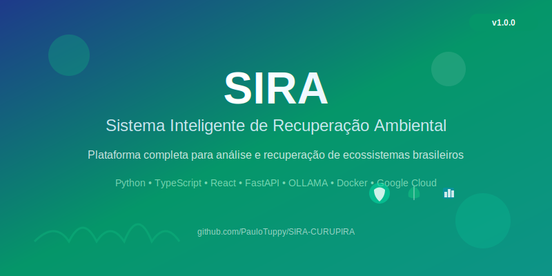

<div align="center">
  
</div>

<div align="center">

# 🌍 SIRA - Sistema Inteligente de Recuperação Ambiental

**Sistema Inteligente de Recuperação Ambiental** - Uma plataforma completa para análise e recuperação de ecossistemas brasileiros usando IA avançada e dados científicos.

</div>

<div align="center">

[](https://opensource.org/licenses/MIT)
[](https://www.python.org/downloads/)
[](https://nodejs.org/)
[](https://www.docker.com/)
[](https://github.com/PauloTuppy/SIRA-CURUPIRA)
[](https://github.com/PauloTuppy/SIRA-CURUPIRA)

</div>

## 🎯 Visão Geral

O SIRA combina inteligência artificial, dados científicos e expertise ambiental para:

- 🔍 **Identificar biomas** brasileiros com precisão
- 🦋 **Analisar biodiversidade** usando dados de GBIF, IUCN, OBIS, eBird
- 📋 **Gerar planos de recuperação** personalizados e viáveis
- 🤖 **Processar linguagem natural** com modelo Gemma 2 9B especializado
- 📊 **Monitorar progresso** com métricas e dashboards

## 🏗️ Arquitetura

- **Frontend**: React/Vite + TypeScript (Firebase Hosting)
- **Backend**: Python ADK + FastAPI (Cloud Run)
- **RAG Service**: TypeScript Genkit (Cloud Functions)
- **GPU Service**: Gemma 3 + OLLAMA (Cloud Run GPU)
- **Dados**: Firestore Vector Search + Cloud Storage

## 🚀 Quick Start

### Pré-requisitos

- Node.js 18+
- Python 3.11+
- Firebase CLI
- Google Cloud CLI
- Docker (opcional para desenvolvimento local)

### Instalação

```bash
# Clone o repositório
git clone <repository-url>
cd ecosystem-recovery-ai

# Setup do ambiente
./scripts/setup/install-dependencies.sh

# Configurar Firebase
./scripts/setup/setup-firebase.sh

# Configurar Google Cloud
./scripts/setup/setup-gcp.sh
```

### Desenvolvimento Local

```bash
# Frontend (porta 5173)
cd frontend
npm run dev

# Backend (porta 8000)
cd backend
python -m uvicorn src.main:app --reload

# RAG Service (Firebase Functions)
cd rag-service
npm run serve

# GPU Service (porta 8001)
cd gpu-service
python -m uvicorn src.main:app --reload --port 8001
```

## 📁 Estrutura do Projeto

```
ecosystem-recovery-ai/
├── frontend/           # React/Vite frontend
├── backend/            # Python ADK + FastAPI
├── rag-service/        # TypeScript Genkit RAG
├── gpu-service/        # Gemma 3 GPU service
├── scripts/            # Scripts de automação
├── tests/              # Testes automatizados
├── infrastructure/     # IaC e monitoramento
└── docs/               # Documentação
```

## 🤖 Agentes Especializados

### Coordinator Agent
Orquestra análises e sintetiza resultados dos agentes especializados.

### Image Analysis Agent
Análise visual com Gemini Vision para detecção de:
- Focos de Aedes aegypti
- Espécies invasoras
- Estado da cobertura vegetal

### Ecosystem Balance Agent
Análise de biodiversidade com Gemma 3 + RAG para:
- Avaliação de equilíbrio ecológico
- Identificação de desequilíbrios
- Recomendações de conservação

### Recovery Plan Agent
Geração de planos de recuperação com Gemini + RAG:
- Estratégias de restauração
- Cronogramas de implementação
- Métricas de sucesso

## 🔍 Base de Conhecimento RAG

Integração com fontes científicas:
- **GBIF**: Dados de biodiversidade global
- **IUCN Red List**: Status de conservação
- **OBIS**: Biodiversidade marinha
- **eBird**: Dados de aves e indicadores

## 🚀 Deploy

### Deploy Completo
```bash
./scripts/deploy/deploy-all.sh
```

### Deploy Individual
```bash
./scripts/deploy/deploy-backend.sh
./scripts/deploy/deploy-rag-service.sh
./scripts/deploy/deploy-gpu-service.sh
./scripts/deploy/deploy-frontend.sh
```

## 🧪 Testes

```bash
# Todos os testes
npm run test:all

# Por serviço
npm run test:backend
npm run test:rag-service
npm run test:gpu-service
npm run test:frontend
```

## 📊 Monitoramento

- **Logs**: Cloud Logging
- **Métricas**: Cloud Monitoring
- **Alertas**: Configurados para todos os serviços
- **Dashboards**: Grafana + Cloud Monitoring

## 🔧 Configuração

### Variáveis de Ambiente

Copie `.env.example` para `.env` e configure:

```bash
# Google Cloud
GOOGLE_CLOUD_PROJECT=your-project-id
GOOGLE_APPLICATION_CREDENTIALS=path/to/credentials.json

# APIs
GEMINI_API_KEY=your-gemini-api-key
VERTEX_AI_LOCATION=us-central1

# Services
BACKEND_URL=http://localhost:8000
RAG_SERVICE_URL=http://localhost:5001
GPU_SERVICE_URL=http://localhost:8001

# Firebase
FIREBASE_PROJECT_ID=your-firebase-project
FIRESTORE_DATABASE=your-firestore-db
```

## 📚 Documentação

- [Arquitetura Atual](docs/current-architecture.md)
- [Arquitetura Híbrida](docs/hybrid-architecture.md)
- [Estrutura do Projeto](docs/project-structure.md)
- [APIs](docs/api-specs/)

## 🤝 Contribuição

1. Fork o projeto
2. Crie uma branch para sua feature
3. Commit suas mudanças
4. Push para a branch
5. Abra um Pull Request

## 📄 Licença

Este projeto está sob a licença MIT. Veja o arquivo [LICENSE](LICENSE) para detalhes.

## 🆘 Suporte

Para suporte, abra uma issue no GitHub ou entre em contato com a equipe de desenvolvimento.
