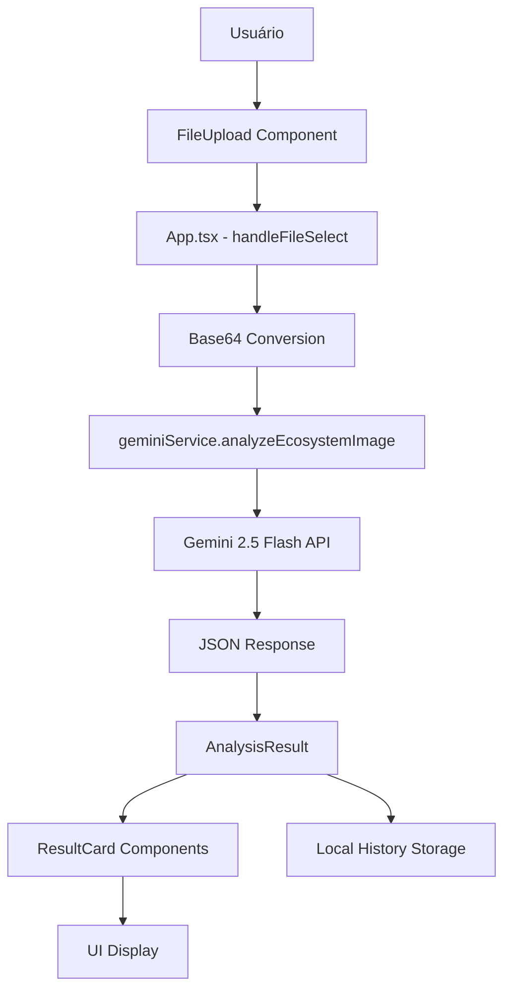

# Arquitetura Atual - Sistema Inteligente de Recuperação Ambiental

## Visão Geral

O sistema atual é uma aplicação frontend React/Vite com integração direta à API Gemini para análise de imagens de ecossistemas. A aplicação permite upload de imagens e fornece análises ambientais detalhadas.

## Estrutura Atual do Projeto

```
ecosystem-recovery-ai/
├── sistema-inteligente-de-recuperação-ambiental (1)/  # Frontend React/Vite
│   ├── components/                                    # Componentes React
│   │   ├── FileUpload.tsx                            # Upload de arquivos
│   │   ├── Header.tsx                                # Cabeçalho da aplicação
│   │   ├── Sidebar.tsx                               # Barra lateral
│   │   ├── ResultCard.tsx                            # Cards de resultados
│   │   ├── MapPlaceholder.tsx                        # Placeholder do mapa
│   │   └── icons.tsx                                 # Ícones SVG
│   ├── services/
│   │   └── geminiService.ts                          # Integração Gemini API
│   ├── types.ts                                      # Definições TypeScript
│   ├── App.tsx                                       # Componente principal
│   └── package.json                                  # Dependências
├── ecosystem-agents/                                 # Agentes ADK (parcialmente implementados)
│   ├── coordinator_agent/
│   ├── image_analysis_agent/
│   ├── ecosystem_balance_agent/
│   └── recovery_plan_agent/
└── firebase-backend/                                 # Backend Firebase (vazio)
    └── functions/
```

## Componentes Frontend Existentes

### 1. Tipos TypeScript (types.ts)

```typescript
interface InvasiveSpecies {
  nome: string;
  risco: 'Alto' | 'Médio' | 'Baixo';
  descricao: string;
}

interface AnalysisResult {
  riscoDengue: 'Alto' | 'Médio' | 'Baixo' | 'N/A';
  especiesInvasoras: InvasiveSpecies[];
  viabilidadeRestauracao: 'Alta' | 'Média' | 'Baixa';
  planoRecuperacao: string[];
  resumoEcossistema: string;
}

interface ProjectHistoryItem {
  id: string;
  fileName: string;
  date: string;
  thumbnail: string;
  result: AnalysisResult;
}
```

### 2. Serviço Gemini (geminiService.ts)

- **Modelo**: Gemini 2.5 Flash
- **Funcionalidade**: Análise multimodal de imagens
- **Saída**: JSON estruturado conforme AnalysisResult
- **Prompt**: Especializado em ecossistemas brasileiros
- **Detecções**: Aedes aegypti, espécies invasoras, viabilidade de restauração

### 3. Componentes React

#### FileUpload.tsx
- Upload de imagens/vídeos
- Preview de arquivos
- Validação de tipos de arquivo

#### Header.tsx
- Navegação principal
- Branding SIRA

#### Sidebar.tsx
- Menu lateral
- Navegação entre seções

#### ResultCard.tsx
- Exibição de métricas
- Cards coloridos por risco
- Ícones contextuais

#### MapPlaceholder.tsx
- Placeholder para integração futura com mapas

### 4. App.tsx - Fluxo Principal

1. **Upload**: Usuário seleciona arquivo
2. **Processamento**: Conversão para base64
3. **Análise**: Chamada para Gemini API
4. **Resultados**: Exibição estruturada
5. **Histórico**: Armazenamento local

## Funcionalidades Implementadas

### ✅ Funcionalidades Existentes
- Upload de imagens/vídeos
- Análise via Gemini Vision
- Detecção de espécies invasoras
- Avaliação de risco de dengue
- Planos de recuperação
- Histórico de análises (local)
- Interface responsiva
- Estados de loading/erro

### ❌ Limitações Atuais
- Integração direta com API (sem backend)
- Sem persistência de dados
- Sem sistema multi-agente
- Sem RAG (Retrieval Augmented Generation)
- Sem especialização por domínio
- Sem escalabilidade cloud
- Sem processamento GPU otimizado
- Sem base de conhecimento estruturada

## Dependências Atuais

### Frontend (package.json)
```json
{
  "dependencies": {
    "react": "^19.2.0",
    "@google/genai": "^1.24.0",
    "react-dom": "^19.2.0"
  },
  "devDependencies": {
    "@types/node": "^22.14.0",
    "@vitejs/plugin-react": "^5.0.0",
    "typescript": "~5.8.2",
    "vite": "^6.2.0"
  }
}
```

### Agentes ADK (parcialmente implementados)
- Estrutura básica criada
- Implementação incompleta
- Sem integração funcional

## Fluxo de Dados Atual



## Pontos Fortes da Arquitetura Atual

1. **Interface Intuitiva**: UI bem estruturada e responsiva
2. **Tipos Bem Definidos**: TypeScript com interfaces claras
3. **Componentização**: Componentes React reutilizáveis
4. **Integração Gemini**: Funcionando corretamente
5. **Estrutura Modular**: Separação clara de responsabilidades

## Oportunidades de Melhoria

1. **Arquitetura Backend**: Necessária para escalabilidade
2. **Sistema Multi-Agente**: Especialização por domínio
3. **RAG Implementation**: Base de conhecimento contextual
4. **GPU Optimization**: Processamento especializado
5. **Cloud Infrastructure**: Deploy e escalabilidade
6. **Data Persistence**: Armazenamento estruturado
7. **Real-time Updates**: Feedback de progresso
8. **API Documentation**: Especificações OpenAPI

## Próximos Passos

A arquitetura atual serve como base sólida para evolução para um sistema híbrido com:
- Backend Python ADK + FastAPI
- RAG Service TypeScript Genkit
- GPU Service Gemma 3
- Frontend React aprimorado
- Infraestrutura cloud-native
