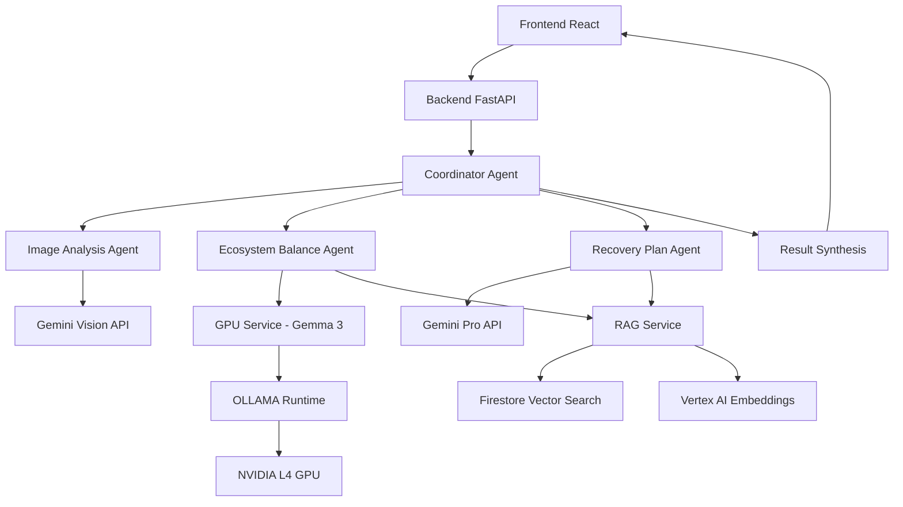

# Arquitetura Híbrida - Sistema Inteligente de Recuperação Ambiental

## Visão Geral

A nova arquitetura híbrida combina o frontend React/Vite existente com uma infraestrutura backend cloud-native, sistema multi-agente ADK, RAG contextualizado e processamento GPU especializado.

## Componentes da Arquitetura

### 1. Frontend React/Vite (Aprimorado)
- **Localização**: Firebase Hosting
- **Tecnologias**: React 19, TypeScript, Vite
- **Funcionalidades**: 
  - Interface existente preservada
  - Novo API client para backend
  - Real-time updates via SSE
  - Environment configuration

### 2. Backend ADK + FastAPI
- **Localização**: Cloud Run
- **Tecnologias**: Python, ADK, FastAPI, Uvicorn
- **Responsabilidades**:
  - Orquestração de agentes
  - Endpoints REST e SSE
  - Coordenação de análises
  - Integração com serviços

### 3. RAG Service (Genkit)
- **Localização**: Cloud Functions
- **Tecnologias**: TypeScript, Genkit, Firebase
- **Funcionalidades**:
  - Retrieval Augmented Generation
  - Firestore Vector Search
  - Vertex AI Embeddings
  - Base de conhecimento contextual

### 4. GPU Service (Gemma 3)
- **Localização**: Cloud Run GPU (NVIDIA L4)
- **Tecnologias**: Python, Gemma 3, OLLAMA, FastAPI
- **Especialização**: Inferência otimizada para biodiversidade

### 5. Dados e Armazenamento
- **Firestore**: Dados estruturados e vector search
- **Cloud Storage**: Imagens e arquivos
- **Vertex AI**: Embeddings e ML services

## Arquitetura de Agentes ADK

### Coordinator Agent
- **Modelo**: Gemini Pro
- **Função**: Orquestração e síntese
- **Responsabilidades**:
  - Receber requisições do frontend
  - Coordenar 3 agentes especializados
  - Sintetizar resultados finais
  - Retornar AnalysisResult estruturado

### Image Analysis Agent
- **Modelo**: Gemini Vision Pro
- **Especialização**: Análise visual de ecossistemas
- **Detecções**:
  - Focos de Aedes aegypti (água parada)
  - Espécies invasoras (caramujos, baronesa)
  - Estado da cobertura vegetal
  - Sinais de desequilíbrio ambiental

### Ecosystem Balance Agent
- **Modelo**: Gemma 3 (via GPU Service)
- **RAG**: Integração com base de conhecimento
- **Especialização**: Biodiversidade e equilíbrio ecológico
- **Análises**:
  - Avaliação de biodiversidade
  - Identificação de desequilíbrios
  - Impactos ecológicos
  - Recomendações de conservação

### Recovery Plan Agent
- **Modelo**: Gemini Pro
- **RAG**: Dados de restauração e técnicas
- **Especialização**: Planos de recuperação ambiental
- **Outputs**:
  - Estratégias de restauração
  - Cronogramas de implementação
  - Recursos necessários
  - Métricas de sucesso

## Fluxo de Dados Híbrido



## Base de Conhecimento RAG

### Fontes de Dados
1. **GBIF** (Global Biodiversity Information Facility)
   - Dados de ocorrência de espécies
   - Distribuição geográfica
   - Status de conservação

2. **IUCN Red List**
   - Status de ameaça de espécies
   - Critérios de conservação
   - Planos de ação

3. **OBIS** (Ocean Biodiversity Information System)
   - Biodiversidade marinha
   - Ecossistemas aquáticos
   - Espécies invasoras marinhas

4. **eBird**
   - Dados de aves
   - Padrões migratórios
   - Indicadores ecológicos

### Processamento RAG
1. **Ingestão**: Scripts automatizados para coleta de dados
2. **Embeddings**: Vertex AI Text Embeddings
3. **Indexação**: Firestore Vector Search
4. **Retrieval**: Busca contextual por similaridade
5. **Augmentation**: Enriquecimento de prompts

## Especificações Técnicas

### Backend FastAPI
```python
# Endpoints principais
POST /api/v1/analyze          # Análise de imagem
GET  /api/v1/analysis/{id}    # Status da análise
GET  /api/v1/stream/{id}      # SSE updates
GET  /api/v1/history          # Histórico de análises
```

### RAG Service Endpoints
```typescript
// Cloud Functions
POST /rag/query               # Query contextual
POST /rag/embed               # Gerar embeddings
GET  /rag/similar             # Busca por similaridade
POST /rag/ingest              # Ingestão de dados
```

### GPU Service API
```python
# Gemma 3 Inference
POST /gpu/infer               # Inferência especializada
POST /gpu/batch               # Processamento em lote
GET  /gpu/health              # Status do serviço
GET  /gpu/metrics             # Métricas de performance
```

## Configuração de Deploy

### Cloud Run Services
1. **Backend**: 
   - CPU: 2 vCPU, 4GB RAM
   - Scaling: 0-10 instances
   - Timeout: 300s

2. **GPU Service**:
   - GPU: NVIDIA L4
   - CPU: 4 vCPU, 16GB RAM
   - Scaling: 0-3 instances
   - Timeout: 600s

### Firebase Services
1. **Hosting**: Frontend React
2. **Functions**: RAG Service
3. **Firestore**: Dados e vector search
4. **Storage**: Arquivos e imagens

### Vertex AI
1. **Embeddings**: text-embedding-004
2. **Models**: Gemini Pro, Gemini Vision
3. **Endpoints**: Custom model serving

## Benefícios da Arquitetura Híbrida

### Escalabilidade
- Auto-scaling baseado em demanda
- Processamento distribuído
- Cache inteligente

### Especialização
- Agentes especializados por domínio
- Modelos otimizados para cada tarefa
- RAG contextualizado

### Performance
- GPU dedicado para inferência pesada
- CDN global via Firebase
- Caching em múltiplas camadas

### Confiabilidade
- Redundância de serviços
- Monitoramento integrado
- Rollback automático

### Custo-Efetividade
- Pay-per-use scaling
- GPU apenas quando necessário
- Otimização de recursos

## Segurança e Compliance

### Autenticação
- Firebase Auth
- Service-to-service authentication
- API keys management

### Dados
- Encryption at rest e in transit
- GDPR compliance
- Data retention policies

### Monitoramento
- Cloud Monitoring
- Error Reporting
- Performance tracking

## Próximos Passos de Implementação

1. **Preparação**: Estrutura de diretórios e ambiente
2. **Backend**: FastAPI + ADK + Agentes
3. **RAG**: Genkit + Firestore Vector Search
4. **GPU**: Gemma 3 + OLLAMA container
5. **Frontend**: API client + melhorias
6. **Deploy**: Scripts automatizados + CI/CD
7. **Testes**: Cobertura completa + documentação
